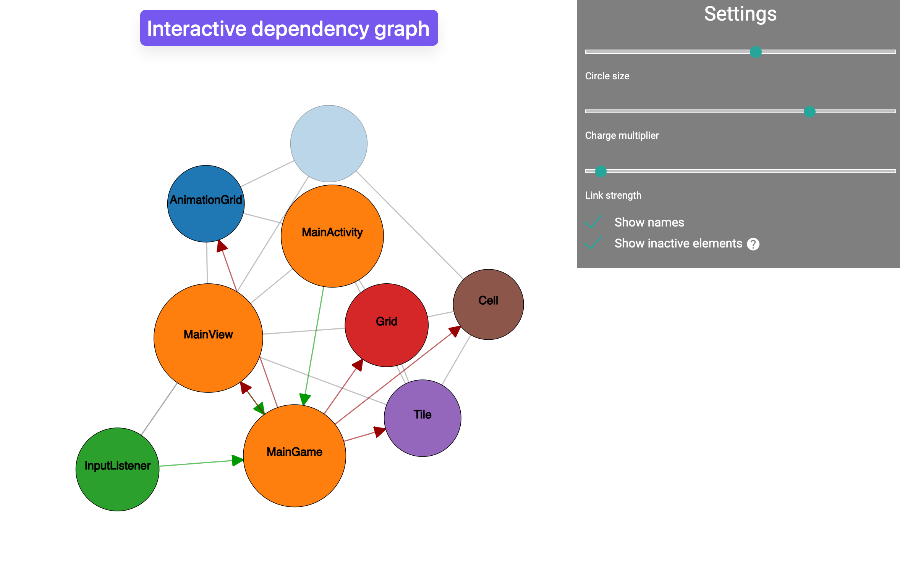

# Decompiled Android Game 2048

This project aims to demonstrate the process of decompiling the APK file of the game [2048](https://github.com/uberspot/2048-android) and converting it into a buildable Gradle Java project.

## Steps

1. **Grab APK File**
    - Obtain the APK file by building it from the source available on the [2048 GitHub repository](https://github.com/gabrielecirulli/2048).

2. **Create APK Dependency Graph**
    - Use a [Apk Dependency Graph (ADG)](https://github.com/alexzaitsev/apk-dependency-graph) generate the APK dependency graph. This is helpful for understanding the structure of the APK and also the relationships between classes.

3. **Export Project Using [Jadx](https://github.com/skylot/jadx)**
    - Utilize Jadx to decompile the APK and export it as a Gradle project.

4. **Import Gradle Project and Set Up Environment**
    - **Open Project with Android Studio**
        - Open the decompiled project in Android Studio. This step would create a new Android Studio project with some automatic configurations (`gradlew`, `gradle.properties`, etc.)
    - **Update Environment**
        - Set the appropriate Java version.
        - Update the Gradle version.
        - Set the compile SDK level. (default would not match to the original APK)
        - Add necessary Gradle configurations.

5. **Remove Decompiled Library Code and Resources**
    - Remove Android support packages, XML resources, and drawables from the decompiled code.

6. **Remove `R.java`**
    - Delete the generated `R.java` class for ID resources.

7. **Fix Decompiler and Logic Errors**
    - Address decompiler errors and logic issues.
    - Use external tools like Bytecode Viewer and JEB to assist in fixing errors.

## Tools Used

- **Jadx**: For decompiling the APK and exporting it as a Gradle project.
- **Android Studio**: For importing and setting up the Gradle project.
- **Bytecode Viewer**: For viewing and analyzing bytecode.
- **JEB**: For advanced decompilation and debugging.
- **Apk Dependency Graph**: For generating the APK dependency graph.

## Contributing

Contributions are welcome! Please fork the repository and submit a pull request with your changes.

## License

This project is licensed under the MIT License. See the `LICENSE` file for more details.
